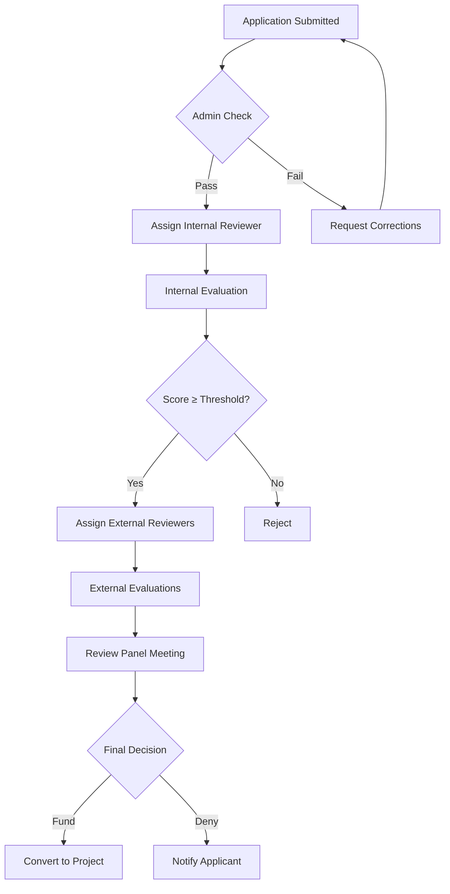

## Overview

As a research office manager, you oversee the complete lifecycle of research funding—from configuring grant calls to approving applications, monitoring project execution, and generating institutional reports. This guide covers your key responsibilities and workflows.

## Main Responsibilities

<CardGroup cols={2}>
  <Card title="Grant Call Management" icon="bullhorn">
    Configure and publish funding opportunities, set eligibility criteria, and manage application deadlines.
  </Card>
  
  <Card title="Application Review" icon="clipboard-check">
    Review and approve grant applications from researchers in your management unit.
  </Card>
  
  <Card title="Project Oversight" icon="folder-open">
    Monitor active projects, track budgets, and ensure compliance with funding requirements.
  </Card>
  
  <Card title="Ethics Coordination" icon="scale-balanced">
    Support ethics committees and manage ethics review workflows.
  </Card>
  
  <Card title="Institutional Reporting" icon="chart-bar">
    Generate reports on research activity, funding, and outcomes for leadership and external agencies.
  </Card>
  
  <Card title="Committee Management" icon="users-gear">
    Configure review committees, assign evaluators, and manage decision workflows.
  </Card>
</CardGroup>

## Configuring Grant Calls

Grant calls (Convocatorias) define funding opportunities that researchers can apply for.

<Steps>
  <Step title="Create New Call">
    Navigate to **CSP** > **Convocatorias** > **New**
    
    Provide basic information:
    - Call title and code
    - Funding agency/program
    - Application opening and closing dates
    - Management unit responsible
    
    Location: `sgi-webapp/src/app/module/csp/convocatoria/convocatoria-crear`
  </Step>
  
  <Step title="Define Call Parameters">
    Configure detailed call settings across multiple tabs:
    
    **Datos Generales**:
    - Call type and purpose
    - Funding model (competitive, non-competitive)
    - Expected number of awards
    - Total funding available
    
    **Plazos**:
    - Application deadline
    - Evaluation period
    - Resolution notification date
    - Project start date range
    
    **Entidades Convocantes**:
    - Funding organizations
    - Program/scheme details
    - Contact information
  </Step>
  
  <Step title="Set Eligibility Requirements">
    Define who can apply:
    
    **Requisitos IP** (Principal Investigator):
    - Academic level required (PhD, Professor, etc.)
    - Maximum age or career stage
    - Previous funding restrictions
    - Institutional affiliation requirements
    
    **Requisitos Equipo** (Team):
    - Minimum/maximum team size
    - Required expertise areas
    - Collaboration requirements
  </Step>
  
  <Step title="Configure Budget Rules">
    Set financial parameters:
    
    **Budget Limits**:
    - Minimum/maximum funding per project
    - Total call budget
    - Cost category restrictions
    
    **Elegibilidad**:
    - Allowed expense types
    - Overhead rate
    - Co-funding requirements
    - Budget justification rules
    
    **Partidas Presupuestarias**:
    - Define budget line categories
    - Set percentage limits by category
    - Configure virement rules
  </Step>
  
  <Step title="Attach Documentation">
    Add call documents:
    - Full call text
    - Application forms and templates
    - Eligibility guidelines
    - Evaluation criteria
    - Legal terms and conditions
    
    These documents are visible to researchers when browsing calls.
  </Step>
  
  <Step title="Publish Call">
    Once configuration is complete:
    1. Review all settings
    2. Set call status to **Published**
    3. Researchers can now view and apply
    
    <Info>You can save calls as drafts and publish them later. Researchers only see published calls.</Info>
  </Step>
</Steps>

### Call Configuration Templates

Create templates for recurring call types:
- Annual institutional grants
- PhD fellowships
- Equipment grants
- Travel awards

Templates preserve:
- Budget categories and limits
- Eligibility criteria
- Required documentation
- Evaluation criteria

## Approving Applications

Applications from your management unit require your review and approval.

### Application Review Workflow

<Steps>
  <Step title="Access Pending Applications">
    Navigate to **CSP** > **Solicitudes**
    
    Filter by:
    - Your management unit
    - Status: **Solicitada** (submitted)
    - Call deadline approaching
    - Priority level
    
    <Tip>Set up notifications for new submissions to review them promptly.</Tip>
  </Step>
  
  <Step title="Review Application Details">
    Evaluate each section:
    
    **Administrative Check**:
    - All required fields completed
    - Applicant meets eligibility criteria
    - Supporting documents attached
    - Budget properly formatted
    
    **Scientific Assessment**:
    - Clear objectives and methodology
    - Appropriate team composition
    - Realistic timeline
    - Expected impact
    
    **Budget Review**:
    - Costs properly categorized
    - Justification for major items
    - Compliant with call rules
    - Co-funding secured (if required)
  </Step>
  
  <Step title="Request Clarifications">
    If issues found:
    1. Change status to **Alegaciones** (clarifications requested)
    2. Add comments describing needed changes
    3. Set deadline for resubmission
    4. Researcher receives notification
    
    Researcher can then:
    - View your comments
    - Make corrections
    - Resubmit for review
  </Step>
  
  <Step title="Approve or Reject">
    Make final decision:
    
    **Approve (Admitida)**:
    - Application advances to evaluation
    - Assigned to reviewer pool
    - Researcher notified of acceptance
    
    **Reject (Denegada)**:
    - State clear reasons
    - Application archived
    - Researcher notified with explanation
    
    <Warning>Rejections should include specific reasons referencing call eligibility criteria.</Warning>
  </Step>
</Steps>

### Batch Application Processing

For calls with many applications:

1. **Export Applications**
   - Download application list to Excel
   - Review offline with team
   - Track decisions in spreadsheet

2. **Bulk Status Updates**
   - Import decision results
   - Update multiple applications at once
   - Send batch notifications

3. **Generate Review Reports**
   - Summary statistics
   - Applications by department
   - Funding requested vs. available
   - Approval rates

## Overseeing Project Portfolios

Monitor active projects across your management unit.

<CardGroup cols={2}>
  <Card title="Project Dashboard" icon="chart-line">
    View all active projects with key metrics: budget burn rate, deliverable status, and upcoming deadlines.
  </Card>
  
  <Card title="Budget Monitoring" icon="coins">
    Track financial execution across projects and identify over/under-spending.
  </Card>
  
  <Card title="Milestone Tracking" icon="flag-checkered">
    Monitor progress on scientific and administrative milestones.
  </Card>
  
  <Card title="Risk Assessment" icon="triangle-exclamation">
    Identify projects at risk due to delays, budget issues, or team changes.
  </Card>
</CardGroup>

### Project Portfolio Reports

<Accordion title="Active Projects by Status">
  Generate reports showing:
  - Total active projects
  - Projects by phase (startup, execution, closeout)
  - Projects approaching end date
  - Projects requiring extensions
  
  Use filters:
  - By funding source
  - By principal investigator
  - By department
  - By budget size
</Accordion>

<Accordion title="Budget Execution Summary">
  Analyze financial performance:
  - Total allocated vs. spent
  - Spending by category
  - Under-execution risks
  - Budget transfers needed
  - Uncommitted funds
  
  Export to Excel for detailed analysis.
</Accordion>

<Accordion title="Deliverable Compliance">
  Track deliverable submissions:
  - Reports due this month
  - Overdue reports
  - Upcoming scientific reviews
  - External evaluations pending
  
  Send reminders to PIs for overdue items.
</Accordion>

<Accordion title="Team Composition Analysis">
  Understand researcher participation:
  - Active researchers by project
  - Researcher dedication levels
  - Team diversity metrics
  - Training and development
</Accordion>

## Managing Ethics Committees

Support ethics committee operations and workflows.

### Ethics Committee Setup

<Accordion title="Committee Configuration">
  For each ethics committee (CEISH, CEEA, CBE):
  
  1. **Define Committee Structure**:
     - Committee name and type
     - Active period
     - Meeting frequency
     - Quorum requirements
  
  2. **Assign Members**:
     - Chair
     - Secretary (manages administrative tasks)
     - Voting members
     - Expert consultants
     - Support staff
  
  3. **Set Review Procedures**:
     - Full board review vs. expedited
     - Criteria for each review type
     - Decision-making process
     - Appeal procedures
</Accordion>

<Accordion title="Meeting Scheduling">
  Plan committee meetings:
  
  1. Navigate to **ETI** > **Comité** > **Convocatorias**
  2. Create new meeting:
     - Date and time
     - Location or video conferencing link
     - Submission deadline (e.g., 2 weeks before)
     - Maximum agenda items
  3. System automatically assigns submitted memorias
  
  <Info>Researchers see the next meeting date when submitting, helping them plan accordingly.</Info>
</Accordion>

<Accordion title="Evaluation Assignments">
  Distribute review workload:
  
  **Primary Reviewer**:
  - Assigned based on expertise
  - Prepares detailed evaluation
  - Presents at committee meeting
  
  **Secondary Reviewer**:
  - Provides independent assessment
  - Checks primary reviewer's analysis
  - Required for complex protocols
  
  **Conflict of Interest**:
  - System flags potential conflicts
  - Members recuse themselves
  - Alternative reviewers assigned
</Accordion>

### Managing Ethics Reviews

<Steps>
  <Step title="Review Submissions">
    Access pending memorias:
    - View submission queue
    - Check completeness
    - Assign to appropriate committee
    - Schedule for next meeting
  </Step>
  
  <Step title="Prepare Meeting Agenda">
    Create agenda:
    - List all items for review
    - Assign presentation time
    - Distribute materials to members
    - Include previous meeting minutes
  </Step>
  
  <Step title="Conduct Meeting">
    During committee session:
    - Record attendance
    - Review each submission
    - Document discussion
    - Record decisions and votes
    - Note required modifications
  </Step>
  
  <Step title="Communicate Decisions">
    After meeting:
    - Generate decision letters
    - Send to researchers
    - Request modifications if needed
    - Set follow-up deadlines
    - Archive meeting records
  </Step>
</Steps>

### Ethics Reporting

<Accordion title="Committee Activity Reports">
  Generate reports on:
  - Number of submissions received
  - Average review time
  - Approval/rejection rates
  - Types of research reviewed
  - Serious adverse events reported
</Accordion>

<Accordion title="Protocol Tracking">
  Monitor approved protocols:
  - Active protocols requiring annual review
  - Protocols approaching completion
  - Amendments requested
  - Adverse events reported
  - Protocol violations
</Accordion>

## Generating Institutional Reports

Create reports for leadership, funding agencies, and external stakeholders.

### Standard Report Types

<CardGroup cols={2}>
  <Card title="Research Activity Summary" icon="chart-pie">
    Overview of:
    - Total active projects
    - New grants awarded
    - Total funding managed
    - Publications produced
    - Research personnel
  </Card>
  
  <Card title="Financial Reports" icon="money-bill-trend-up">
    Financial metrics:
    - Funding by source
    - Expenditure by category
    - Overhead recovered
    - Co-funding leveraged
  </Card>
  
  <Card title="Compliance Reports" icon="clipboard-check">
    Track compliance:
    - Ethics approvals obtained
    - Required reports submitted
    - Audit findings
    - Policy adherence
  </Card>
  
  <Card title="Impact Reports" icon="rocket">
    Demonstrate impact:
    - Publications and citations
    - Patents filed/granted
    - Technology transfers
    - Training outcomes
  </Card>
</CardGroup>

### Custom Report Builder

<Steps>
  <Step title="Select Data Sources">
    Choose what to include:
    - Projects (CSP module)
    - Publications (PRC module)
    - Intellectual property (PII module)
    - Ethics reviews (ETI module)
  </Step>
  
  <Step title="Apply Filters">
    Narrow scope:
    - Date range
    - Department/unit
    - Funding source
    - Project status
    - Researcher
  </Step>
  
  <Step title="Select Metrics">
    Choose what to measure:
    - Count of items
    - Sum of funding
    - Average values
    - Trends over time
    - Comparative analysis
  </Step>
  
  <Step title="Format Output">
    Generate report:
    - Excel spreadsheet
    - PDF document
    - Chart/graph visualization
    - Interactive dashboard
  </Step>
</Steps>

### Scheduled Reports

Automate recurring reports:

<Accordion title="Monthly Reports">
  **Activity Summary**:
  - New applications submitted
  - Applications approved/rejected
  - New projects started
  - Projects completed
  - Budget execution rate
  
  Delivered to: Unit director, financial office
</Accordion>

<Accordion title="Quarterly Reports">
  **Performance Metrics**:
  - Funding success rates
  - Average time to approval
  - Project portfolio health
  - Research output summary
  
  Delivered to: Leadership team, deans
</Accordion>

<Accordion title="Annual Reports">
  **Comprehensive Analysis**:
  - Year-over-year trends
  - Benchmark against goals
  - Researcher participation
  - Financial sustainability
  - Strategic recommendations
  
  Delivered to: Executive leadership, governing board
</Accordion>

## Advanced Workflows

### Multi-Stage Application Review

For competitive calls with external reviewers:

### Project Extension Approval

<Steps>
  <Step title="PI Requests Extension">
    Researcher submits extension request including:
    - Justification for delay
    - New end date
    - Remaining activities
    - Budget implications
  </Step>
  
  <Step title="Manager Review">
    Evaluate request:
    - Check funding agency rules
    - Verify scientific justification
    - Assess budget status
    - Review project history
  </Step>
  
  <Step title="Agency Approval">
    If required:
    - Submit request to funding agency
    - Track approval status
    - Communicate decision to PI
  </Step>
  
  <Step title="Update System">
    Once approved:
    - Update project end date
    - Adjust milestones
    - Notify financial office
    - Update reporting schedule
  </Step>
</Steps>

### Budget Modification Workflow

Managing budget reallocations:

<Accordion title="Minor Reallocations">
  Transfers within allowed limits (typically less than 10%):
  1. PI submits justification
  2. Manager approves in system
  3. Financial office notified
  4. Budget updated automatically
  
  No external approval needed.
</Accordion>

<Accordion title="Major Reallocations">
  Transfers exceeding thresholds:
  1. PI submits detailed justification
  2. Manager reviews and endorses
  3. Submitted to funding agency
  4. Await approval
  5. Update budget upon approval
  
  May require:
  - Written justification
  - Revised budget narrative
  - Updated work plan
</Accordion>

## Key Performance Indicators

Track unit performance:

| Metric | Target | Purpose |
|--------|--------|--------|
| **Application Approval Time** | Less than 5 days | Responsiveness |
| **Funding Success Rate** | Greater than 30% | Competitiveness |
| **Budget Execution Rate** | 85-95% | Financial management |
| **Report Submission Compliance** | Greater than 95% | Accountability |
| **Ethics Review Time** | Less than 30 days | Efficiency |
| **Researcher Satisfaction** | Greater than 4.0/5 | Service quality |

<Tip>
  Review KPIs monthly and adjust processes to address underperformance.
</Tip>

## Best Practices

<AccordionGroup>
  <Accordion title="Proactive Communication">
    - Send deadline reminders 2 weeks in advance
    - Notify PIs of budget execution concerns early
    - Provide regular updates on application status
    - Hold office hours for researcher questions
  </Accordion>
  
  <Accordion title="Standardization">
    - Use templates for common documents
    - Create checklists for reviews
    - Document decision criteria
    - Maintain institutional memory
  </Accordion>
  
  <Accordion title="Capacity Building">
    - Offer grant writing workshops
    - Provide budget planning tools
    - Share success stories
    - Mentor early-career researchers
  </Accordion>
  
  <Accordion title="Continuous Improvement">
    - Collect feedback from researchers
    - Analyze bottlenecks
    - Benchmark against peer institutions
    - Update processes based on lessons learned
  </Accordion>
</AccordionGroup>

## Common Challenges

<Warning>
  **Challenge**: Applications submitted at deadline with errors
  
  **Solution**: 
  - Require draft submission 1 week early
  - Provide quick administrative check
  - Allow time for corrections
</Warning>

<Warning>
  **Challenge**: Researchers don't track budget adequately
  
  **Solution**:
  - Require quarterly budget reviews
  - Set up automatic alerts at 75% spend
  - Provide budget management training
</Warning>

<Warning>
  **Challenge**: Ethics reviews delayed due to incomplete submissions
  
  **Solution**:
  - Create submission checklist
  - Require pre-submission consultation
  - Provide template documents
</Warning>

## Tools and Resources

<CardGroup cols={2}>
  <Card title="Report Templates" icon="file-excel">
    Pre-built Excel templates for common reports and data exports.
  </Card>
  
  <Card title="Process Checklists" icon="list-check">
    Step-by-step guides for application review, project closeout, and audits.
  </Card>
  
  <Card title="Training Materials" icon="book">
    Guides and videos for training researchers and new staff.
  </Card>
  
  <Card title="Policy Documents" icon="gavel">
    Institutional policies on research administration, ethics, and compliance.
  </Card>
</CardGroup>

## Related Documentation

- [Researcher Guide](/guides/researcher) - Understand researcher perspective and needs
- [Administrator Guide](/guides/administrator) - System configuration and settings
- [CSP Module](/modules/csp) - Detailed project management features
- [ETI Module](/modules/eti) - Ethics committee workflows
- [Reporting](/api/rep-service) - API for custom reports