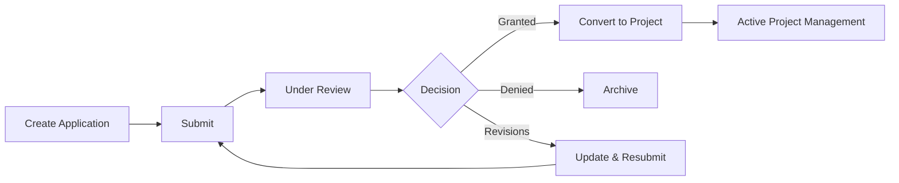
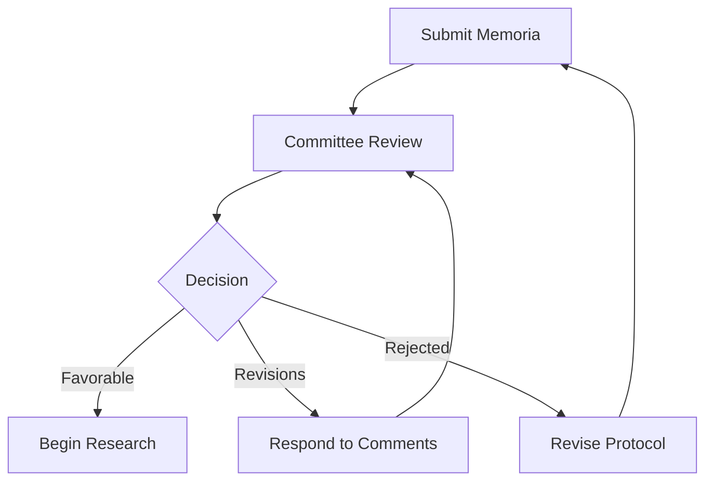

## Overview

As a research investigator, HERCULES SGI helps you manage your entire research lifecycle—from submitting grant applications to tracking intellectual property and documenting scientific production.

## Submitting Grant Applications

The Solicitud (Application) module is your starting point for applying to grant calls.

<Steps>
  <Step title="Access Grant Calls">
    Navigate to **CSP** > **Convocatorias** to view available grant calls. You can filter by:
    - Open/closed status
    - Funding agency
    - Application deadline
    - Research area
  </Step>
  
  <Step title="Create New Application">
    Click **New Application** to start. You'll need to provide:
    - **General Data**: Project title, duration, funding requested
    - **Project Team**: Principal investigator and team members
    - **Budget**: Detailed cost breakdown by category
    - **Documentation**: Required supporting documents
    
    <Info>Applications auto-save as drafts. You can return to complete them before the deadline.</Info>
  </Step>
  
  <Step title="Complete All Sections">
    The application form includes multiple tabs:
    
    - **Datos Generales**: Basic project information
    - **Equipo Proyecto**: Research team composition
    - **Ficha General**: Scientific summary and objectives
    - **Áreas Conocimiento**: Knowledge areas and classifications
    - **Presupuesto Global**: Budget breakdown
    - **Entidades Financiadoras**: Funding organizations
    - **Documentos**: Attach required files (CV, ethics approval, etc.)
    
    Each section must be completed before submission.
  </Step>
  
  <Step title="Submit for Review">
    Once all required fields are complete, click **Submit**. Your application enters the review workflow and you'll receive notifications about status changes.
    
    <Warning>After submission, you cannot edit the application unless it's returned for revisions.</Warning>
  </Step>
</Steps>

### Application Status Tracking

Your applications can have the following states:

| Status | Description |
|--------|-------------|
| **Borrador** | Draft - still editable |
| **Solicitada** | Submitted - under review |
| **Admitida** | Admitted for evaluation |
| **Alegaciones** | Returned for clarifications |
| **Concedida** | Granted |
| **Denegada** | Denied |
| **Desistida** | Withdrawn |

## Managing Research Projects

Once your application is granted, it becomes a Proyecto (Project) that you can actively manage.

<CardGroup cols={2}>
  <Card title="Project Dashboard" icon="chart-line">
    View project health, budget status, team members, and upcoming milestones from your project dashboard.
  </Card>
  
  <Card title="Budget Tracking" icon="coins">
    Monitor spending across budget categories and compare planned vs. actual expenditures.
  </Card>
  
  <Card title="Team Management" icon="users">
    Add or remove team members and define their roles and dedication percentages.
  </Card>
  
  <Card title="Deliverables" icon="file-check">
    Track scientific and technical milestones, reports, and deliverables.
  </Card>
</CardGroup>

### Key Project Management Tasks

<Accordion title="Updating Project Information">
  Navigate to your project and click **Edit**. You can update:
  - Project duration (extensions require approval)
  - Team composition
  - Budget reallocation (within allowed limits)
  - Contact information
  
  Location: `sgi-webapp/src/app/module/csp/proyecto/proyecto-editar`
</Accordion>

<Accordion title="Managing Project Phases">
  Projects are divided into phases with specific deliverables:
  1. Go to **Proyecto** > **Fases**
  2. Define phase start/end dates
  3. Assign deliverables and milestones
  4. Track completion status
</Accordion>

<Accordion title="Budget Execution">
  Monitor and justify expenses:
  - View **Ejecución Económica** for real-time budget status
  - Track expenses by category (personnel, equipment, travel, etc.)
  - Generate justification reports for funding agencies
  - Upload receipts and supporting documentation
</Accordion>

<Accordion title="Scientific Follow-up">
  Document scientific progress:
  - Submit periodic scientific reports
  - Upload publications and outputs
  - Document methodology changes
  - Report deviations from original plan
</Accordion>

## Submitting Ethics Reviews

For research involving human subjects, animals, or sensitive data, you must submit for ethics review.

<Steps>
  <Step title="Create Ethics Memoria">
    Navigate to **ETI** > **Memorias** and click **New**.
    
    Select the appropriate committee:
    - **CEISH**: Human subjects research
    - **CEEA**: Animal research  
    - **CBE**: Biosafety
    
    Location: `sgi-webapp/src/app/module/eti/memoria/memoria-crear`
  </Step>
  
  <Step title="Complete Ethics Application">
    Provide detailed information about:
    - Research objectives and methodology
    - Participant recruitment and consent procedures
    - Data protection measures
    - Risk assessment and mitigation
    - Anticipated benefits
  </Step>
  
  <Step title="Submit for Committee Review">
    Your submission will be scheduled for the next committee meeting. You'll receive:
    - Meeting date notification
    - Deadline for additional documentation
    - Committee decision (approval, conditional approval, or modifications required)
    
    <Info>The next evaluation date is automatically displayed based on the committee calendar.</Info>
  </Step>
  
  <Step title="Respond to Committee Feedback">
    If modifications are requested:
    1. Review committee comments in the **Comentarios** section
    2. Make required changes to your protocol
    3. Upload revised documents
    4. Resubmit for review
  </Step>
</Steps>

### Ethics Review Outcomes

- **Favorable**: Approved to proceed
- **Favorable Pendiente de Revisión Mínima**: Minor revisions required
- **Pendiente de Correcciones**: Significant changes needed
- **No Procede Evaluar**: Outside committee scope
- **Desfavorable**: Not approved

## Tracking Intellectual Property

Protect your research innovations through the PII (Industrial and Intellectual Property) module.

<Accordion title="Registering an Invention">
  When you create a potentially patentable invention:
  
  1. Navigate to **PII** > **Invenciones** > **New**
  2. Complete the invention disclosure form:
     - Technical description
     - Inventors and their contributions
     - Related projects or funding
     - Prior art search results
  3. Submit to the technology transfer office
  
  The office will evaluate patentability and commercialization potential.
  
  Location: `sgi-webapp/src/app/module/pii/invencion/invencion-crear`
</Accordion>

<Accordion title="Managing Patent Applications">
  Track your patent applications:
  - View application status (filed, granted, abandoned)
  - Monitor maintenance fees and deadlines
  - Track related expenses
  - Document licensing agreements
</Accordion>

<Accordion title="Tracking IP Agreements">
  Document agreements related to your IP:
  - Licensing contracts
  - Material transfer agreements
  - Non-disclosure agreements
  - Revenue sharing arrangements
</Accordion>

## Viewing Scientific Production

Document your research outputs in the PRC (Scientific Production) module.

<CardGroup cols={2}>
  <Card title="Publications" icon="book">
    Register journal articles, book chapters, and conference papers. Include DOI, impact factor, and co-authors.
  </Card>
  
  <Card title="Congresses" icon="presentation">
    Log conference presentations, invited talks, and poster sessions.
  </Card>
  
  <Card title="Artistic Works" icon="palette">
    Document exhibitions, performances, and creative outputs.
  </Card>
  
  <Card title="Thesis Supervision" icon="graduation-cap">
    Track PhD, Master's, and Bachelor's thesis supervision.
  </Card>
</CardGroup>

### Registering a Publication

<Steps>
  <Step title="Access Publications Module">
    Go to **PRC** > **Publicaciones** > **New**
  </Step>
  
  <Step title="Enter Publication Details">
    - Title and abstract
    - Journal name and ISSN
    - Publication date
    - DOI or URL
    - Authors and affiliations
    - Related projects (for acknowledgment tracking)
  </Step>
  
  <Step title="Link to Projects">
    Associate the publication with funded projects. This is essential for:
    - Grant compliance reporting
    - Impact assessment
    - Institutional metrics
  </Step>
</Steps>

<Note>
  Publications linked to projects automatically appear in institutional reports and project evaluations.
</Note>

## Common Workflows

### From Application to Active Project

### Ethics Review Workflow

## Tips for Researchers

<Tip>
  **Plan Ahead**: Submit applications at least 2 weeks before deadlines to allow time for technical issues and revisions.
</Tip>

<Tip>
  **Keep Documentation Updated**: Regularly update your CV, publication list, and research group information to speed up future applications.
</Tip>

<Tip>
  **Monitor Deadlines**: Use the system's notification features to track report deadlines, budget justifications, and ethics renewals.
</Tip>

<Tip>
  **Link Everything**: Always associate publications, IP, and outputs with their funding projects for accurate impact tracking.
</Tip>

## Getting Help

<CardGroup cols={2}>
  <Card title="Research Office" icon="building">
    Contact your institutional research office for help with applications and project management.
  </Card>
  
  <Card title="Ethics Committees" icon="scale-balanced">
    Reach out to committee secretaries for ethics review questions.
  </Card>
  
  <Card title="Tech Transfer" icon="lightbulb">
    Connect with technology transfer officers for IP and commercialization support.
  </Card>
  
  <Card title="System Support" icon="headset">
    Report technical issues to your IT helpdesk.
  </Card>
</CardGroup>

## Related Documentation

- [CSP Module Overview](/modules/csp) - Detailed project management features
- [ETI Module Overview](/modules/eti) - Ethics committee workflows
- [PII Module Overview](/modules/pii) - Intellectual property management
- [PRC Module Overview](/modules/prc) - Scientific production documentation